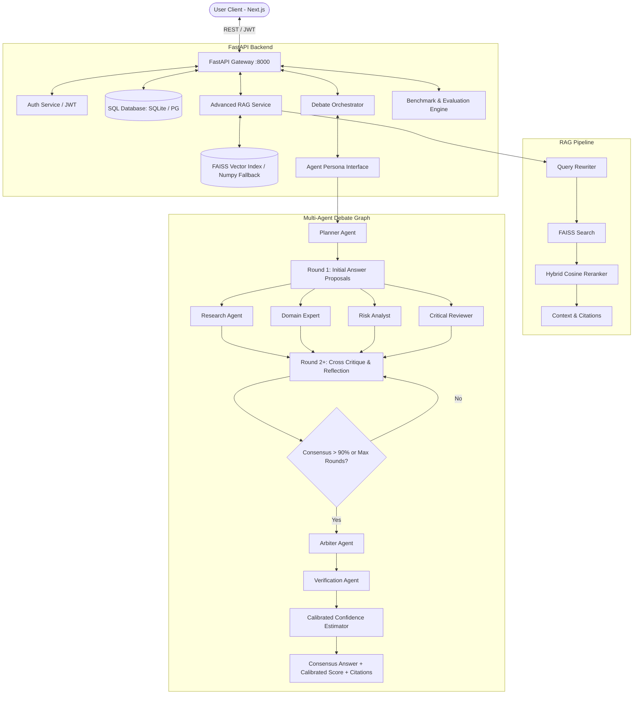
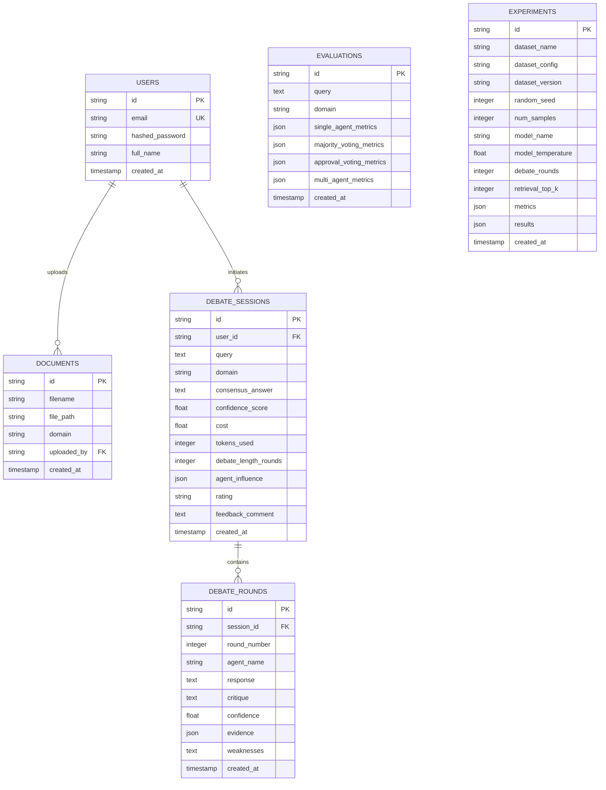

# Multi-Agent Debate-and-Consensus Framework for Domain-Specific Decision Support

A production-grade, research-caliber AI systems platform designed to improve LLM decision-making accuracy, eliminate hallucinations, provide fact-verified citations, and calibrate consensus confidence. 

It implements an iterative **multi-agent state graph debate loop** using specialized LLM personas (Planner, Research Agent, Domain Expert, Risk Analyst, Critical Reviewer, Arbiter, and Verification Agent) evaluated systematically against single-agent and voting baselines on domain-specific benchmarks.

---

## 📑 Table of Contents
- [System Architecture](#-system-architecture)
- [Execution Sequence Diagram](#-execution-sequence-diagram)
- [Database ER Diagram](#️-database-er-diagram)
- [Folder Structure](#-folder-structure)
- [Web Application Overview](#-web-application-overview)
- [REST API Reference](#-rest-api-reference)
- [Getting Started & Local Setup](#-getting-started--local-setup)
- [Automated Testing](#-automated-testing)
- [Dataset & Research Benchmark](#-dataset--research-benchmark)
- [Evaluation Methodology & Baselines](#-evaluation-methodology--baselines)

---

## 🗺️ System Architecture



---

## 🔄 Execution Sequence Diagram

```mermaid
sequenceDiagram
    autonumber
    actor User as User Client (Next.js)
    participant API as FastAPI Gateway (:8000)
    participant RAG as RAG Pipeline
    participant Orch as Debate Orchestrator
    participant Agents as Debate Agents (Personas)
    participant Arbiter as Arbiter & Verifier
    database DB as SQLite / FAISS

    User->>API: Submit Query & Domain Tag (e.g., Healthcare, Finance, Legal)
    API->>DB: Create Debate Session Record
    API->>RAG: Retrieve Context Chunks
    RAG->>DB: Query Dense Vector Embeddings (FAISS / Local)
    DB-->>RAG: Return Top-K Candidate Chunks
    RAG->>RAG: Rerank Chunks (Cosine Similarity)
    RAG-->>API: Return Reranked Context + Citations
    
    API->>Orch: Initiate Multi-Agent Debate Loop
    Orch->>Agents: Round 1: Generate Persona Draft Answers
    Agents-->>Orch: Return Responses, Confidence & Evidence
    
    loop Debate rounds (Until Consensus >= 90% or Max Rounds)
        Orch->>Agents: Peer Critique, Counter-Arguments & Self-Reflection
        Agents-->>Orch: Return Revised Positions & Cross-Critiques
    end
    
    Orch->>Arbiter: Synthesize Turn-by-Turn Debate Transcript
    Arbiter-->>Orch: Return Synthesized Consensus Answer & Justification
    Orch->>Arbiter: Verify Factual Grounding against Retrieved Evidence
    Orch->>Orch: Compute Calibrated Confidence Score & Agent Influence
    Orch->>DB: Persist Rounds, Metrics, Agent Influence & Consensus
    API-->>User: Return Consensus Decision, Metrics, Round Logs & PDF Export
```

---

## 🗄️ Database ER Diagram



---

## 📂 Folder Structure

```
.
├── backend/
│   ├── app/
│   │   ├── api/
│   │   │   └── endpoints/
│   │   │       ├── auth.py         # Authentication (Register, Login, JWT tokens)
│   │   │       ├── debate.py       # Debate orchestration, sessions, export, feedback
│   │   │       ├── rag.py          # Document upload, chunking, FAISS search
│   │   │       ├── evaluation.py   # Benchmark runs, comparative metrics, analytics
│   │   │       └── dataset.py      # Benchmark dataset explorer & inspection endpoints
│   │   ├── core/
│   │   │   ├── config.py           # App configuration, directory setup, environment vars
│   │   │   └── security.py         # Passlib bcrypt hashing & JWT token handling
│   │   ├── db/
│   │   │   └── database.py         # SQLAlchemy engine, session maker, base declarations
│   │   ├── models/
│   │   │   └── models.py           # DB models: User, Document, DebateSession, DebateRound, Evaluation, Experiment
│   │   ├── schemas/
│   │   │   └── schemas.py          # Pydantic schemas for request validation & response formatting
│   │   ├── services/
│   │   │   ├── auth_service.py     # Auth helper utilities & JWT dependency
│   │   │   ├── debate_service.py   # Multi-agent persona state machine, round loops & arbiters
│   │   │   ├── rag_service.py      # FAISS dense index, sentence embedder & cosine reranker
│   │   │   └── eval_service.py     # Comparative metrics: BLEU, ROUGE-L, Faithfulness, Accuracy
│   │   └── main.py                 # FastAPI application root, auto-migration & CORS config
│   ├── tests/
│   │   ├── test_dataset.py         # Dataset loading, adapter & evaluation pipeline tests
│   │   ├── test_debate.py          # Debate state machine, sessions & feedback tests
│   │   └── test_rag.py             # Chunking, query rewriting & vector index tests
│   ├── Dockerfile                  # Container definition for FastAPI backend
│   ├── requirements.txt            # Python dependencies (FastAPI, SQLAlchemy, PyTorch, FAISS, etc.)
│   └── run.py                      # Production / Dev runner entry point for Uvicorn
├── frontend/
│   ├── app/
│   │   ├── analytics/page.tsx      # System-wide metrics, agent influence, feedback distribution
│   │   ├── dataset/page.tsx        # Dataset benchmark explorer, sample viewer & statistics charts
│   │   ├── debate/page.tsx         # Interactive debate board, persona rounds, consensus & PDF export
│   │   ├── documents/page.tsx      # RAG document management, file upload & chunking visualizer
│   │   ├── evaluation/page.tsx     # Live benchmark comparison suite (Single vs Voting vs Debate)
│   │   ├── login/page.tsx          # User login & registration screen
│   │   ├── globals.css             # Design system styling tokens, themes & custom utilities
│   │   ├── layout.tsx              # Root Next.js layout & sidebar navigation wrapper
│   │   └── page.tsx                # Executive Dashboard with live KPI counters & quick actions
│   ├── components/
│   │   └── Sidebar.tsx             # Responsive global navigation sidebar with debate history
│   ├── package.json                # Frontend dependencies (Next.js 16, React 19, Recharts, Lucide)
│   └── Dockerfile                  # Container definition for Next.js client
├── data/
│   └── debate/
│       ├── raw_dataset.json        # Raw downloaded benchmark records from Hugging Face
│       └── processed_dataset.json  # Cleaned, standardized 80/20 train-eval dataset split
├── scripts/
│   ├── download_debate.py          # Script to download benchmark from Hugging Face
│   └── prepare_debate_dataset.py   # Script to normalize, tokenize & split benchmark records
├── docker-compose.yml              # Multi-container service orchestrator
└── README.md                       # Comprehensive platform documentation
```

---

## 💻 Web Application Overview

The Next.js web application provides an intuitive graphical interface for decision-makers and researchers:

1. **Executive Dashboard (`/`)**: High-level platform KPIs including active debate sessions, total indexed documents, mean consensus confidence, and agent participation breakdown.
2. **Dataset Explorer (`/dataset`)**: Inspect the `Multi-Agent-LLMs/DEBATE` benchmark with turn distributions, persona frequency charts, and sample inspector.
3. **Agent Debate Board (`/debate`)**:
   - Live multi-turn round visualization across specialized personas:
     - **Planner**: Deconstructs complex queries into prioritized debate sub-problems.
     - **Research Agent**: Queries the RAG index to retrieve authoritative grounding evidence.
     - **Domain Expert**: Delivers rigorous technical and domain-specific perspectives.
     - **Risk Analyst**: Identifies vulnerabilities, compliance concerns, and edge cases.
     - **Critical Reviewer**: Challenges assumptions and points out logical inconsistencies.
     - **Arbiter**: Synthesizes conflicting arguments into a cohesive consensus decision.
     - **Verification Agent**: Validates factual fidelity against cited documents.
   - Real-time confidence calibration gauges.
   - Thumbs up/down feedback and comment submission.
   - Automated PDF report download for executive dissemination.
4. **RAG Document Hub (`/documents`)**: Upload multi-domain knowledge files (TXT, MD, PDF) into domain partitions (Healthcare, Finance, Legal, Technology) with real-time chunk preview.
5. **Benchmark Suite (`/evaluation`)**: Run empirical side-by-side evaluations across single-agent baseline, majority voting, approval voting, and our debate framework with BLEU, ROUGE-L, faithfulness, latency, and token cost.
6. **Analytics Dashboard (`/analytics`)**: Aggregate statistics on agent influence weightings, round lengths, cost trends, and user feedback ratings.

---

## 🔌 REST API Reference

The backend exposes a RESTful API organized into modular routers under `/api/v1`:

### 1. Authentication (`/api/v1/auth`)
| Method | Endpoint | Description |
| :--- | :--- | :--- |
| `POST` | `/api/v1/auth/register` | Register a new user account |
| `POST` | `/api/v1/auth/login` | Authenticate and obtain JWT access token |

### 2. Debate Orchestrator (`/api/v1/debate`)
| Method | Endpoint | Description |
| :--- | :--- | :--- |
| `POST` | `/api/v1/debate/start` | Start a live multi-agent debate session |
| `GET` | `/api/v1/debate/sessions` | List all historical debate sessions |
| `GET` | `/api/v1/debate/sessions/{id}` | Fetch session transcript, rounds, and consensus |
| `POST` | `/api/v1/debate/sessions/{id}/feedback` | Submit human rating (thumbs up/down) and review comment |
| `GET` | `/api/v1/debate/sessions/{id}/export` | Generate and stream a publication-ready PDF report |

### 3. RAG Ingestion Engine (`/api/v1/rag`)
| Method | Endpoint | Description |
| :--- | :--- | :--- |
| `POST` | `/api/v1/rag/upload` | Upload and vectorize document for a target domain |
| `GET` | `/api/v1/rag/documents` | List all indexed documents by domain |
| `POST` | `/api/v1/rag/query` | Test dense FAISS vector retrieval & hybrid reranking |

### 4. Benchmark & Evaluation (`/api/v1/evaluation`)
| Method | Endpoint | Description |
| :--- | :--- | :--- |
| `POST` | `/api/v1/evaluation/evaluate` | Run comparative benchmark for a custom query |
| `GET` | `/api/v1/evaluation/evaluations` | List historical comparative evaluations |
| `POST` | `/api/v1/evaluation/dataset` | Execute batch benchmark run on dataset samples |
| `GET` | `/api/v1/evaluation/experiments` | List completed experiment benchmark runs |
| `GET` | `/api/v1/evaluation/experiments/{id}` | Inspect detailed metrics and results for an experiment |
| `GET` | `/api/v1/evaluation/analytics` | Retrieve aggregate metrics, agent influence, and feedback |

### 5. Dataset Explorer (`/api/v1/dataset`)
| Method | Endpoint | Description |
| :--- | :--- | :--- |
| `GET` | `/api/v1/dataset/status` | Check local download and preprocessing status |
| `GET` | `/api/v1/dataset/info` | Get dataset metadata, configurations, and split details |
| `GET` | `/api/v1/dataset/samples` | Retrieve sample records from train or evaluation splits |
| `GET` | `/api/v1/dataset/statistics` | Get turn distributions, persona frequencies, and word lengths |

---

## 🚀 Getting Started & Local Setup

### Prerequisites
- **Node.js**: v18.0.0 or higher (v20+ recommended)
- **Python**: 3.10, 3.11, or 3.12
- **Docker & Docker Compose** (optional for containerized deployment)

---

### Option 1: Docker Compose (Quickest)

Build and boot both backend and frontend services simultaneously:
```bash
docker-compose up --build
```
- **Frontend**: [http://localhost:3000](http://localhost:3000)
- **Backend API**: [http://localhost:8000](http://localhost:8000)
- **Interactive Swagger Docs**: [http://localhost:8000/docs](http://localhost:8000/docs)
- **Alternative ReDoc**: [http://localhost:8000/redoc](http://localhost:8000/redoc)

---

### Option 2: Local Development Setup

#### 1. Backend Setup (FastAPI)

1. Open a terminal and navigate to `backend/`:
   ```bash
   cd backend
   ```

2. Create and activate a Python virtual environment:
   - **On Windows (PowerShell)**:
     ```powershell
     python -m venv venv
     .\venv\Scripts\Activate.ps1
     ```
   - **On Linux / macOS**:
     ```bash
     python3 -m venv venv
     source venv/bin/activate
     ```

3. Install required Python packages:
   ```bash
   pip install -r requirements.txt
   ```

4. *(Optional)* Configure OpenAI API Key:
   > **Note**: If `OPENAI_API_KEY` is omitted, the framework automatically falls back to built-in offline simulation mode, allowing complete testing, vector search, consensus arbitration, and debate loops with zero API dependencies.
   - **Windows**:
     ```powershell
     $env:OPENAI_API_KEY="your-openai-api-key"
     ```
   - **Linux / macOS**:
     ```bash
     export OPENAI_API_KEY="your-openai-api-key"
     ```

5. Launch the backend server:
   ```bash
   python run.py
   ```
   *The server starts on `http://localhost:8000` with hot-reload enabled.*

#### 2. Frontend Setup (Next.js)

1. Open a separate terminal and navigate to `frontend/`:
   ```bash
   cd frontend
   ```

2. Install Node.js dependencies:
   ```bash
   npm install --legacy-peer-deps
   ```

3. Start the Next.js development server:
   ```bash
   npm run dev
   ```

4. Open [http://localhost:3000](http://localhost:3000) in your web browser.

---

## 🧪 Automated Testing

The backend includes a comprehensive pytest suite covering dataset adapters, debate orchestration, feedback endpoints, text chunking, query rewriting, and vector similarity search.

Run the test suite from the `backend/` folder:
```bash
cd backend
python -m pytest tests -v
```

Expected output:
```text
tests/test_dataset.py::test_dataset_files PASSED
tests/test_dataset.py::test_debate_dataset_adapter PASSED
tests/test_dataset.py::test_run_dataset_evaluation PASSED
tests/test_debate.py::test_debate_pipeline PASSED
tests/test_debate.py::test_feedback_and_analytics_endpoints PASSED
tests/test_rag.py::test_chunk_text PASSED
tests/test_rag.py::test_query_rewrite PASSED
tests/test_rag.py::test_faiss_numpy_fallback_index PASSED
========================== 8 passed in 80s ==========================
```

---

## 📊 Dataset & Research Benchmark

Our project integrates a dedicated evaluation benchmark to test, verify, and measure multi-agent debate and consensus quality.

### 1. Dataset Overview
* **Dataset Name**: `Multi-Agent-LLMs/DEBATE`
* **Source**: [Hugging Face Datasets Hub](https://huggingface.co/datasets/Multi-Agent-LLMs/DEBATE)
* **Configuration Used**: `critical_expert_debate_majority_consensus` (100 multi-turn debate examples)
* **Secondary Subset (for baseline comparison)**: `critical_expert_debate_approval_voting`

### 2. Running the Dataset Pipeline

#### Step 1: Download the Benchmark Data
Downloads the benchmark dataset from Hugging Face and saves it to `data/debate/raw_dataset.json`:
```bash
python scripts/download_debate.py
```

#### Step 2: Preprocess and Split
Cleans, standardizes, and splits the data into 80% train and 20% evaluation with a deterministic random seed (`42`):
```bash
python scripts/prepare_debate_dataset.py
```
Output location: `data/debate/processed_dataset.json`

---

## ⚖️ Evaluation Methodology & Baselines

We evaluate four distinct pipeline configurations across the benchmark:

1. **Baseline 1: Single Agent**: A single LLM assistant answering the query in a single zero-shot/few-shot pass.
2. **Baseline 2: Majority Voting**: Three independent agents generate answers in isolation; the majority answer is selected.
3. **Baseline 3: Approval Voting**: Three agents iteratively review, critique, and vote to approve or modify proposals.
4. **Our Method: Structured Debate + Arbiter**: Full state graph multi-turn debate loop featuring specialized personas (Planner, Research, Expert, Risk, Critic), verified against RAG context, and resolved by the Arbiter with confidence calibration.

### Metrics Measured
- **Accuracy**: Exact matching and semantic alignment against ground-truth references.
- **Semantic Overlap**: Sentence-level BLEU and ROUGE-L metrics.
- **Hallucination Rate & Faithfulness**: Ratio of claims verified against retrieved grounding evidence.
- **Resource Overhead**: End-to-end execution latency (s), token consumption, and estimated monetary cost ($).

---

## 📄 License
This project is developed for research and educational purposes in multi-agent systems and domain-specific decision support.
